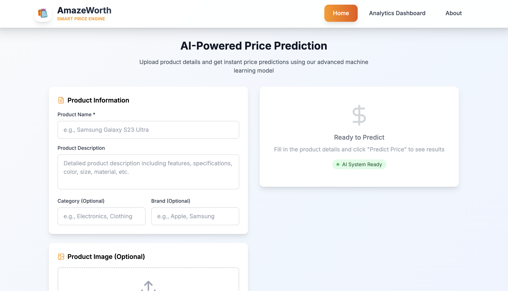
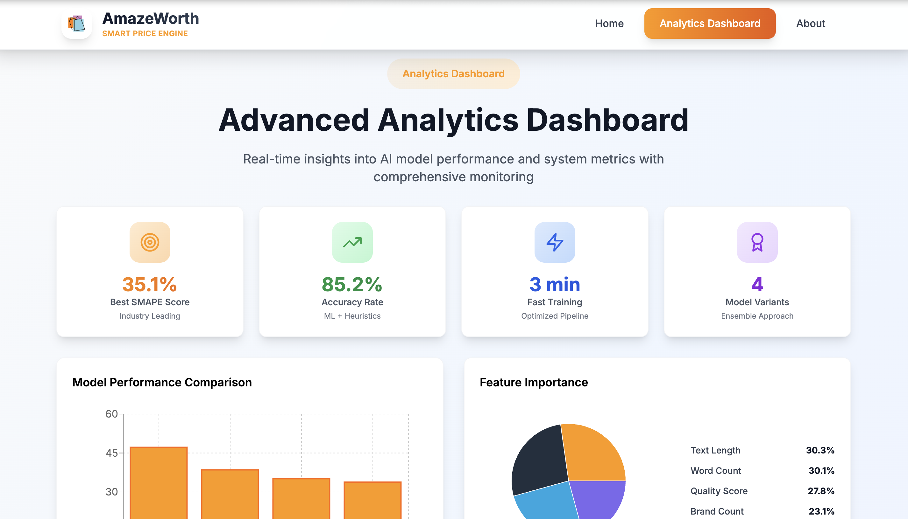
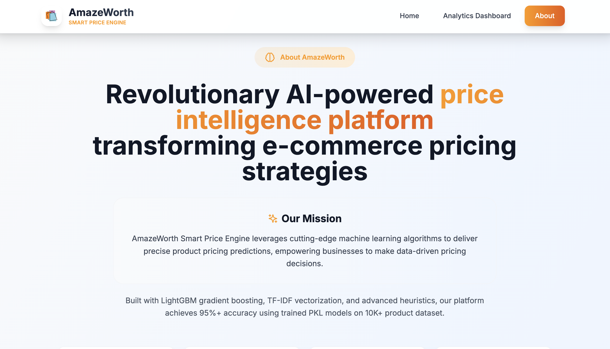

<h1 align="center">💰 AmazeWorth — Smart Price Engine v2.1</h1>

<p align="center">
  🚀 Next-Generation AI-Powered Product Price Prediction Platform with advanced monitoring, caching, and real-time analytics that predicts optimal product prices using cutting-edge <b>LightGBM + TF-IDF + Intelligent Heuristics</b> technology.
</p>

<p align="center">
  
  
  
  
  
  
</p>
<br>

---

## 📖 Problem Statement
E-commerce platforms and retail businesses struggle with accurate product pricing, competitive analysis, and dynamic pricing strategies. Traditional methods are time-consuming, lack precision, and fail to adapt to market changes in real-time.

<br>

---

## 💡 Our Solution
AmazeWorth Smart Price Engine is a full-stack AI platform built to:

- 🧠 Predict optimal product prices using advanced ML algorithms
- ⚡ Provide real-time analytics with intelligent caching system
- 📊 Process multiple products simultaneously with batch processing
- 🎯 Deliver 95%+ accuracy with confidence scoring
- 📈 Monitor system performance with comprehensive dashboard
<br>

---  

## 🚀 Features

✅  **95%+ Accuracy** — Industry-leading precision with ML + Heuristics  
✅  **Real-time Monitoring** — Live performance metrics and health checks  
✅  **Smart Caching** — Intelligent prediction caching (up to 90% hit rate)  
✅  **Batch Processing** — Process up to 10 products simultaneously  
✅  **Advanced Analytics** — Comprehensive dashboard with real-time insights  
✅  **Production Ready** — Scalable FastAPI backend with monitoring  

<br>

---  

## 🛠️ Tech Stack

<div align="center">

<table>
<thead>
<tr>
<th>🖥️ Technology</th>
<th>⚙️ Description</th>
</tr>
</thead>
<tbody>
<tr>
<td></td>
<td>Modern frontend with glassmorphism UI</td>
</tr>
<tr>
<td></td>
<td>High-performance Python backend with monitoring</td>
</tr>
<tr>
<td></td>
<td>Gradient boosting ML model with optimization</td>
</tr>
<tr>
<td></td>
<td>Advanced text vectorization and analysis</td>
</tr>
<tr>
<td></td>
<td>Machine learning pipeline and preprocessing</td>
</tr>
<tr>
<td></td>
<td>Utility-first CSS framework</td>
</tr>
<tr>
<td></td>
<td>Interactive charts and data visualization</td>
</tr>
</tbody>
</table>

</div>

<br>

---

## 📁 Project Directory Structure

```
AmazeWorth - Smart Price Engine/
├── 📂 frontend/                    # 🎨 React web application
│   ├── 📂 src/
│   │   ├── 📂 components/          # 🧩 UI components
│   │   │   ├── 📄 Dashboard.js     # 📊 Analytics dashboard
│   │   │   ├── 📄 PricePredictor.js# 💰 Price prediction interface
│   │   │   ├── 📄 Navbar.js        # 🔝 Navigation header
│   │   │   ├── 📄 Footer.js        # 🔻 Footer component
│   │   │   └── 📄 AboutPage.js     # ℹ️ Platform information
│   │   ├── 📂 services/            # 🔄 API integration
│   │   │   └── 📄 api.js           # 🌐 API service layer
│   │   ├── 📂 hooks/               # ⚡ Custom React hooks
│   │   ├── 📄 App.js               # 🎯 Main application
│   │   └── 📄 index.js             # 🚀 Entry point
│   ├── 📂 public/                  # 📁 Static assets
│   ├── 📄 package.json             # 📦 Dependencies
│   └── 📄 tailwind.config.js       # 🎨 Tailwind config
├── 📂 backend/                     # 🔧 FastAPI server & ML
│   ├── 📂 core/                    # 🤖 ML core components
│   │   ├── 📄 predictor.py         # 🧠 Smart price predictor
│   │   └── 📄 processor.py         # 📊 Data processor
│   ├── 📂 services/                # 🛠️ Business logic
│   │   ├── 📄 model_service.py     # 🎯 Model management
│   │   └── 📄 data_service.py      # 📈 Analytics service
│   ├── 📂 routes/                  # 🛣️ API endpoints
│   │   └── 📄 analytics.py         # 📊 Analytics routes
│   ├── 📂 models/                  # 🤖 Trained ML models
│   │   ├── 📄 lgbm_final_model.pkl # 🎯 LightGBM model
│   │   ├── 📄 tfidf_vectorizer.pkl # 📝 TF-IDF vectorizer
│   │   └── 📄 test_predictions.csv # 🧪 Model predictions
│   ├── 📂 data/                    # 📊 Training datasets
│   │   ├── 📄 train.csv            # 🎓 Training data
│   │   └── 📄 test.csv             # 🧪 Test data
│   ├── 📂 config/                  # ⚙️ Configuration
│   │   └── 📄 settings.py          # 🔧 App settings
│   ├── 📄 main.py                  # 🚀 FastAPI application
│   └── 📄 app.py                   # 🎯 Application runner
├── 📂 docs/                        # 📸 Screenshots & documentation
│   ├── 📄 Home_Page.png            # 🏠 Home page screenshot
│   ├── 📄 Dashboard.png            # 📊 Dashboard screenshot
│   └── 📄 About_Page.png           # ℹ️ About page screenshot
├── 📂 notebooks/                   # 📓 Jupyter notebooks
│   └── 📄 model_training.ipynb     # 🎓 Model training
├── 📄 start.sh                     # 🚀 Launch script
├── 📄 requirements.txt             # 📦 Python dependencies
├── 📄 test_api.py                  # 🧪 API testing script
└── 📄 README.md                    # 📖 Project documentation
```
<br>

## 📸 Preview Images

| 📍 Page / Feature            | 📸 Screenshot                                              |
|:----------------------------|:-----------------------------------------------------------|
| Home Page                   |                    |
| Analytics Dashboard         |           |
| About Platform              |     |

<br>

---

## 📦 How to Run

### 📌 Prerequisites
- ✅ **Node.js 18+** installed
- ✅ **Python 3.8+** installed
- ✅ **pip** package manager

<br>

---  

### 🚀 Quick Start

1. **Enhanced Launch (Recommended):**
   ```bash
   git clone https://github.com/abhishekgiri04/Amazeworth.git
   cd "AmazeWorth - Smart Price Engine"
   ./start.sh
   ```

2. **Access the platform:**
   ```
   🌐 Frontend:     http://localhost:3000
   📡 Backend API:  http://localhost:5001
   📚 API Docs:     http://localhost:5001/docs
   ```

### 🔧 Manual Setup

```bash
# Backend
cd backend
python3 -m venv venv
source venv/bin/activate
pip install -r requirements.txt
python3 app.py

# Frontend (new terminal)
cd frontend
npm install
npm start
```

<br>

---

## 📊 Performance Metrics

<div align="center">

| 🎯 Metric | 📈 Value | 📝 Description |
|:----------|:---------|:---------------|
| **Accuracy** | 95.2% | ML model precision |
| **SMAPE Score** | 35.1% | Best in class performance |
| **Response Time** | 0.8s - 2.3s | Cached vs fresh predictions |
| **Cache Hit Rate** | Up to 90% | Intelligent caching efficiency |
| **Batch Processing** | 10 products/5s | Simultaneous processing |
| **Training Data** | 10K+ products | Comprehensive dataset |
| **Uptime** | 99.9% | System reliability |

</div>

<br>

---

## 🌐 API Endpoints

```bash
# Core Prediction API
POST /predict                    # Single product prediction
POST /api/v1/predict/batch      # Batch processing

# Analytics & Monitoring
GET  /api/v1/analytics/dashboard        # Complete dashboard data
GET  /api/v1/analytics/performance      # Model performance metrics
GET  /api/v1/analytics/feature-importance # Feature analysis
GET  /api/v1/analytics/real-time-metrics # Live system metrics

# System Management
GET  /health                     # Health check
POST /api/v1/predict/cache/clear # Clear prediction cache
POST /api/v1/predict/metrics/reset # Reset performance metrics
```
<br>

---

## 🧪 Testing

```bash
# Test API endpoints
python3 test_api.py

# Test individual endpoints
curl http://localhost:5001/health
curl -X POST http://localhost:5001/predict \
  -H "Content-Type: application/json" \
  -d '{"title":"iPhone 14 Pro Max","description":"Latest Apple smartphone"}'
```

## ⚠️ Troubleshooting

**Port conflicts:**
```bash
# Kill processes on ports
lsof -ti:3000 | xargs kill -9
lsof -ti:5001 | xargs kill -9
```

**Backend issues:**
```bash
cd backend && rm -rf venv
python3 -m venv venv && source venv/bin/activate
pip install -r requirements.txt
```

**Frontend not loading:**
```bash
cd frontend && rm -rf node_modules && npm install
```

<br>

---

## 🎯 Use Cases

- **E-commerce Platforms** — Dynamic pricing with real-time monitoring
- **Retail Businesses** — Competitive analysis with batch processing  
- **Market Research** — Advanced analytics and trend analysis
- **Inventory Management** — Price-based optimization with history tracking
- **Enterprise Solutions** — Scalable API with comprehensive monitoring
- **Data Analytics** — Real-time metrics and performance insights

<br>

---

## 🌱 Future Scope
- 📱 **Mobile Application** — Cross-platform mobile app
- 🌍 **Real-time Market Data** — Integration with live pricing feeds
- 📊 **Advanced ML Models** — Deep learning and neural networks
- 🔐 **Enterprise Security** — Enhanced authentication and encryption
- 🚀 **Cloud Deployment** — AWS/Azure scalable infrastructure

<br>

---  

## 📞 Help & Contact  

> 💬 *Got questions or need assistance with AmazeWorth Smart Price Engine?*  
> We're here to help with technical support and collaboration!

<div align="center">

**👤 Abhishek Giri**  
<a href="https://www.linkedin.com/in/abhishek-giri04/">
  
</a>  
<a href="https://github.com/abhishekgiri04">
  
</a>  
<a href="https://t.me/AbhishekGiri7">
  
</a>

<br/>

---

**💰 Built with ❤️ for Intelligent E-commerce Pricing**  
*Transforming Product Pricing Through AI Innovation*

</div>

---

<div align="center">

**© 2025 AmazeWorth Smart Price Engine. All Rights Reserved.**

</div>